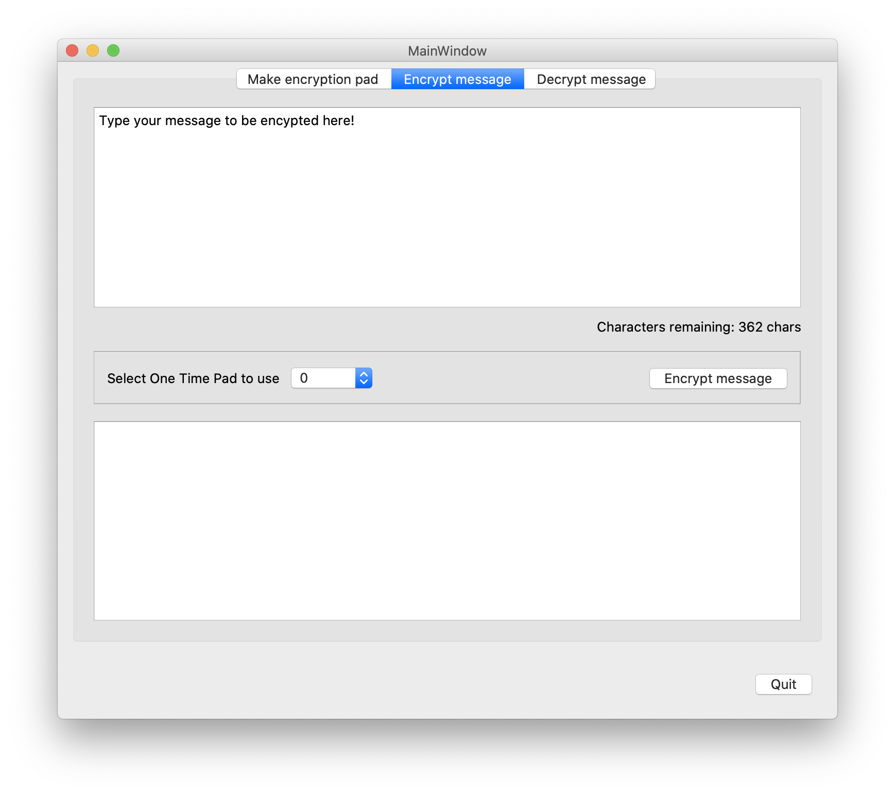
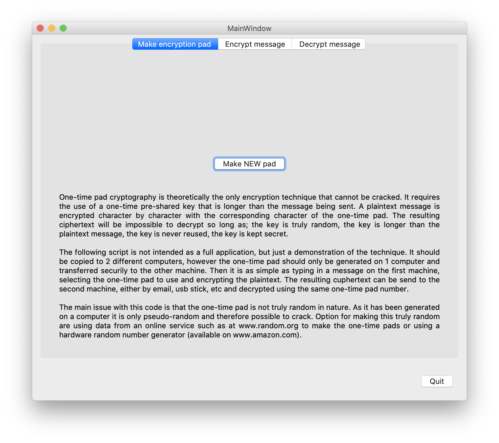
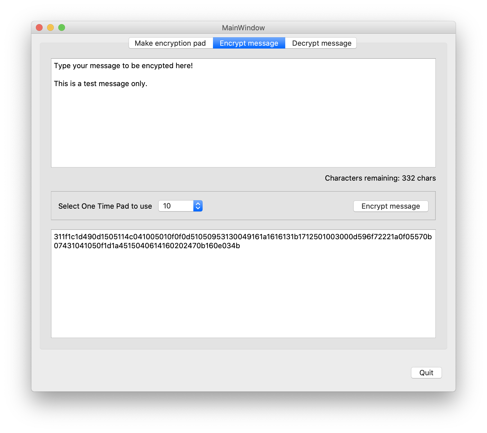
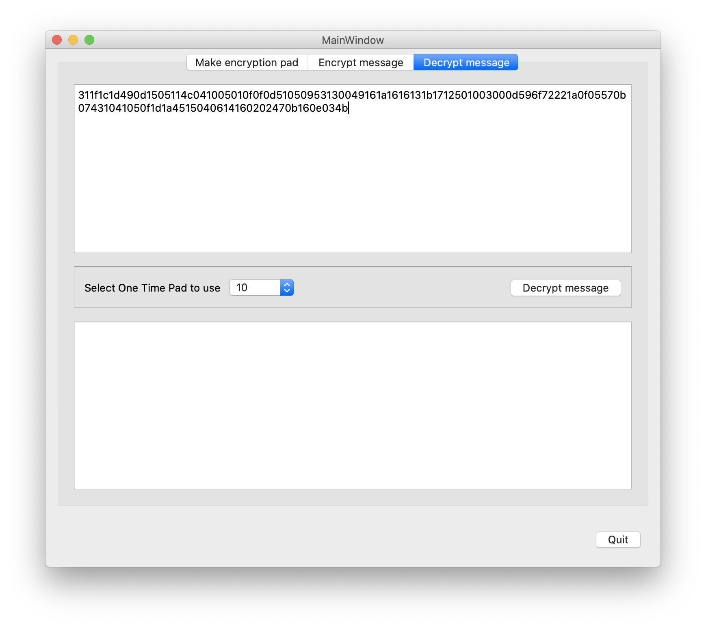

# encryption-OneTimePad
Demonstration python code using pyQT for One Time Pad encryption

One-time pad cryptography is theoretically the only encryption technique that cannot be cracked. It requires the use of a one-time pre-shared key that is longer than the message being sent. A plaintext message is encrypted character by character with the corresponding character of the one-time pad. The resulting ciphertext will be impossible to decrypt so long as; the key is truly random, the key is longer than the plaintext message, the key is never reused, the key is kept secret.

The following script is not intended as a full application, but just a demonstration of the technique. It should be copied to 2 different computers, however the one-time pad should only be generated on 1 computer and transferred securily to the other machine. Then it is as simple as typing in a message on the first machine, selecting the one-time pad to use and encrypting the plaintext. The resulting ciphertext can be send to the second machine, either by email, usb stick, etc and decrypted using the same one-time pad number.

The main issue with this code is that the one-time pad is not truly random in nature. As it has been generated on a computer it is  only pseudo-random and therefore possible to crack. Option for making this truly random are using data from an online service such as at www.random.org to make the one-time pads or using a hardware random number generator (available on www.amazon.com).

## Generating new One Time Pad

If you need to make new One Time Pads it can be done on the 1st tab 'Make encryption pad'. These new pads should only be generated on one computer and transferred securely to the other (receiving) machine. Pad numbers on both machines need to be the same to function correctly.

## Encrypting a message

Type your plaintext into the top edit box on tab 'Encrypt message'. Note maximum length of message is limited to 400 characters to ensure message does not exceed key length. Then select the number of One Time Pad to use in dropdown combobox and press button 'Encrypt message'.
Cipertext will now appear in lower edit box and also be copied to clipboard.

## Decrypting a message

Paste ciphertext into the top edit box on tab 'Decrypt message', select the number of One Time Pad to use in dropdown combobox (note this must be the same Pad as used to encrypt the message). Then press 'Decrypt message' and the plaintext will appear in lower edit box.
If giberish appears in lower edit box then the incorrect One Time Pad has been used for decryption.

## Maintain security
The main method for maintaining security is the secret of the One Time Pad. This is also the main problem with this method, as the One Time Pads available must be the same at both the transmitting and receiving computer yet these pads should not be transmitted electronically (e.g. email) making it logistically difficult to maintain the pads if the number of messages are large.

All One Time Pads are stored in a subfolder - '/Storage' and I have included 10 Pads to get started. As stated above it is possible (and recommended) to generate more from within the program for your own use.

Remember - if anyone has access to the pad used then the message can be decrypted.

Date: 30 January 2021

This source code is provided by Richard J Smith 'as is' and 'with all faults'. The provider makes no representations or warranties of any kind concerning the safety, suitability, inaccuracies, typographical errors, or other harmful components of this software.
